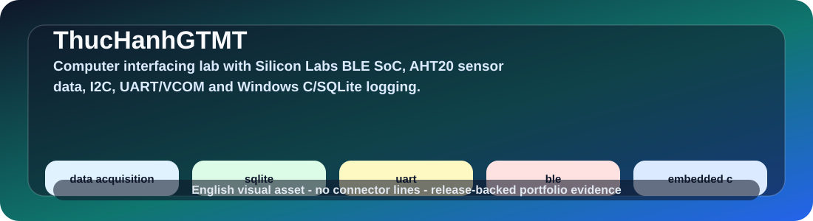
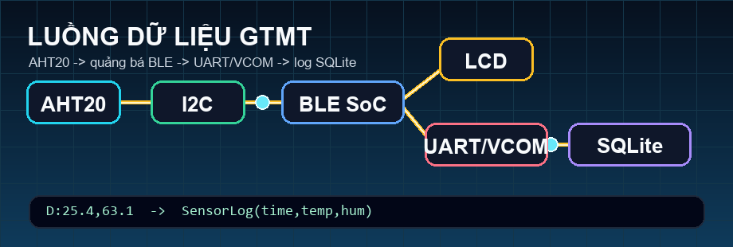
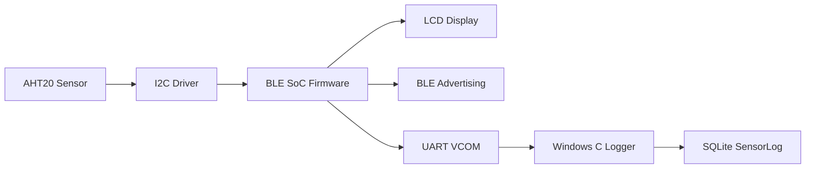
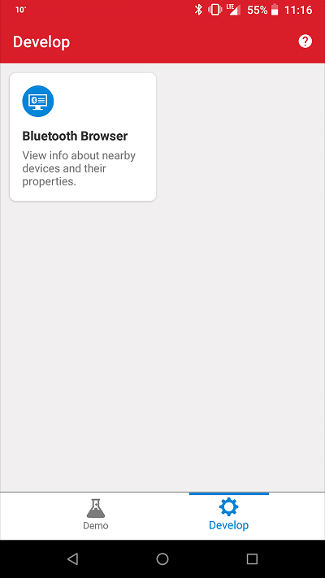
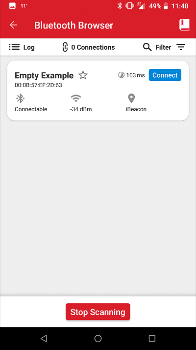
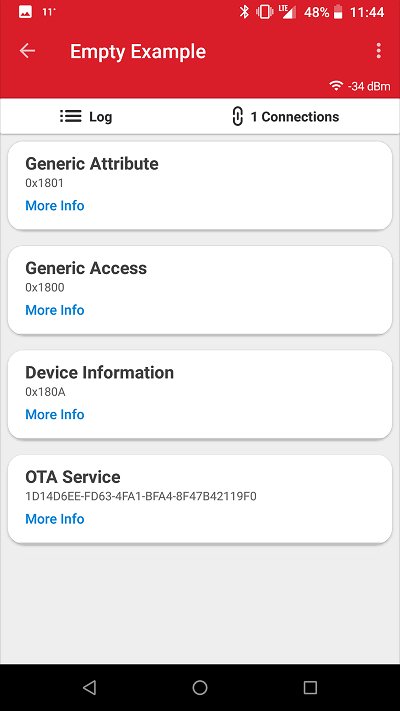

# 🌡️ Thực Hành Giao Tiếp Máy Tính · AHT20 BLE Data Acquisition

<p align="center">
  
  <br />
  
</p>

<p align="center">
  <a href="https://github.com/lhlizdabezt/ThucHanhGTMT/releases/latest"></a>
  <a href="https://github.com/lhlizdabezt/ThucHanhGTMT/tags"></a>
  
  
  
</p>

<p align="center">
  <b>Repo lab Giao tiếp máy tính và Thu nhận dữ liệu</b> của <a href="https://github.com/lhlizdabezt">Lương Hải Long</a>. Hệ thống đọc nhiệt độ/độ ẩm từ AHT20 bằng firmware Silicon Labs BLE SoC, hiển thị LCD, phát BLE advertising, stream UART/VCOM và lưu log trên Windows bằng C + SQLite.
</p>

---

## 🚀 Tóm tắt hệ thống

| Khối | Vai trò | Bằng chứng |
| --- | --- | --- |
| AHT20 | Cảm biến nhiệt độ và độ ẩm qua I2C | `aht20.c`, `aht20.h` |
| Silicon Labs BLE SoC | Đọc cảm biến, cập nhật LCD, phát BLE, ghi UART/VCOM | `app.c`, `custom_adv.c`, `lcd_display.c` |
| LCD | Hiển thị giá trị đo và chu kỳ lấy mẫu | Thư mục `image/` và helper LCD |
| BLE advertising | Đưa dữ liệu cảm biến vào payload quảng bá | Hàm cập nhật advertising payload |
| Windows logger | Đọc COM port, parse dòng `D:temp,hum`, ghi SQLite | `TEST.c`, `sqlite3.c`, `sqlite3.h` |
| Báo cáo/slide | Giải thích mục tiêu, nguyên lý, kết quả và lab BLE Mesh | PDF, PPTX trong root repo |

## 🎯 Đường kiểm tra nhanh cho HR và kỹ sư

| Cần kiểm tra | Mở ở đâu | Tín hiệu kỹ thuật |
| --- | --- | --- |
| Firmware cảm biến | `LONG1_2-20260513T142225Z-3-001/LONG1_2/app.c` | Vòng lặp định kỳ, đọc AHT20, cập nhật LCD, phát BLE và ghi UART |
| Driver ngoại vi | `aht20.c`, `lcd_display.c`, `custom_adv.c` | Tách driver I2C, hiển thị và advertising payload để dễ đọc review |
| Logger máy tính | `TH GTMT-20260513T142230Z-3-001/TH GTMT/TEST.c` | Win32 serial API, parser `D:temp,hum`, insert SQLite `SensorLog` |
| Tài liệu học thuật | `22207056_report_DoAn.pdf`, `22207056_report_lab6.pdf` | Có báo cáo đồ án, slide và lab BLE Mesh để đối chiếu code với thuyết minh |
| Bản public GitHub | [release mới nhất](https://github.com/lhlizdabezt/ThucHanhGTMT/releases/latest) | Có tag, release, topic, README tiếng Việt, visual SVG/GIF và tài liệu đính kèm |

## 🧭 Luồng dữ liệu



## 🖼️ Minh chứng trực quan

GIF ở đầu README mô phỏng đường đi của dữ liệu đo: AHT20 tạo mẫu nhiệt độ/độ ẩm, firmware đóng gói BLE advertising, xuất UART/VCOM và logger Windows lưu vào SQLite. Các ảnh bên dưới là minh chứng phần cứng/hướng dẫn đi kèm trong project Silicon Labs.

<p align="center">
  
  
  
  
  
</p>

## 📂 Cấu trúc repo

| Đường dẫn | Nội dung |
| --- | --- |
| `LONG1_2-20260513T142225Z-3-001/LONG1_2/` | Project firmware Silicon Labs BLE SoC |
| `LONG1_2-20260513T142225Z-3-001/LONG1_2/LONG1_2.slcp` | File project chính để mở bằng Simplicity Studio |
| `LONG1_2-20260513T142225Z-3-001/LONG1_2/app.c` | Luồng ứng dụng: timer, đọc AHT20, LCD, BLE payload, UART log |
| `LONG1_2-20260513T142225Z-3-001/LONG1_2/aht20.c` | Driver AHT20 qua I2C |
| `LONG1_2-20260513T142225Z-3-001/LONG1_2/custom_adv.c` | Tạo payload BLE advertising tùy biến |
| `LONG1_2-20260513T142225Z-3-001/LONG1_2/lcd_display.c` | Hàm hiển thị dữ liệu đo lên LCD |
| `TH GTMT-20260513T142230Z-3-001/TH GTMT/TEST.c` | Logger Windows C đọc UART/VCOM và ghi SQLite |
| `TH GTMT-20260513T142230Z-3-001/TH GTMT/sqlite3.c` | SQLite amalgamation dùng cho logger |
| `22207056_report_DoAn.pdf` | Báo cáo đồ án đo nhiệt độ và độ ẩm |
| `22207056_report_DoAn (2).pptx` | Slide thuyết trình đồ án |
| `22207056_report_lab6.pdf` | Báo cáo lab BLE Mesh |

## ⚙️ Môi trường phát triển

| Mảng | Công cụ |
| --- | --- |
| Firmware | Simplicity Studio, Gecko/Simplicity SDK, GNU Arm Embedded Toolchain |
| Phần cứng | Board Silicon Labs BLE SoC có VCOM/UART, cảm biến AHT20, LCD |
| PC logger | Windows, GCC hoặc MinGW, SQLite amalgamation đã có trong repo |
| Git Windows | Nên bật long paths vì project Silicon Labs có đường dẫn metadata rất dài |

Nếu clone trên Windows báo `Filename too long`, chạy:

```powershell
git config --global core.longpaths true
git restore --source=HEAD :/
```

## 🛠️ Build logger Windows

```powershell
cd "TH GTMT-20260513T142230Z-3-001\TH GTMT"
gcc TEST.c sqlite3.c -o App.exe
.\App.exe
```

Trước khi chạy, sửa COM port trong `TEST.c` theo cổng VCOM thực tế:

```c
const char* COM_PORT_NAME = "\\\\.\\COM10";
```

## 🧪 Điểm kỹ thuật đáng xem

| File | Điểm nổi bật |
| --- | --- |
| `app.c` | Timer định kỳ, gọi driver cảm biến, cập nhật LCD, phát BLE và ghi log UART |
| `aht20.c` | Trình tự đọc cảm biến qua I2C, xử lý dữ liệu nhiệt độ/độ ẩm |
| `custom_adv.c` | Đóng gói dữ liệu cảm biến vào advertising payload |
| `lcd_display.c` | Tách logic hiển thị để firmware dễ đọc hơn |
| `TEST.c` | Win32 serial API, parser dòng dữ liệu và insert vào SQLite |

## 🏷️ Metadata đề xuất

| Nhóm | Nội dung |
| --- | --- |
| Mô tả repo | Lab Giao tiếp máy tính HCMUS FETEL: đọc AHT20 trên Silicon Labs BLE SoC, hiển thị LCD, quảng bá BLE, stream UART/VCOM và ghi log Windows C/SQLite. |
| Topics | `embedded-c`, `ble`, `bluetooth-low-energy`, `silicon-labs`, `aht20`, `i2c`, `lcd`, `uart`, `vcom`, `sqlite`, `win32`, `sensor-logging`, `data-acquisition`, `iot`, `electronics-engineering` |
| Release | Release mới nhất ghi lại phiên bản public có README tiếng Việt, visual SVG/GIF, hướng build, tag, topics, source zip và tài liệu đồ án |

## 👤 Thông tin tác giả

| Trường | Thông tin |
| --- | --- |
| Họ tên | **Lương Hải Long** |
| MSSV | `22207056` |
| Lớp | `22DTV_CLC1` |
| Ngành | Điện tử Viễn thông |
| Khoa | Điện tử - Viễn thông |
| Trường | Trường Đại học Khoa học Tự nhiên, ĐHQG-HCM |
| GitHub | [github.com/lhlizdabezt](https://github.com/lhlizdabezt) |
| LinkedIn | [linkedin.com/in/lhlizdabezt](https://www.linkedin.com/in/lhlizdabezt) |

## 📌 Ghi chú bảo trì

Repo ưu tiên lưu source, cấu hình project và tài liệu cần thiết. File build sinh ra như `.exe`, `.dll`, `.db`, `.o`, `.map`, `.hex`, `.bin` và thư mục output của toolchain nên để ngoài Git, trừ khi release tương lai cần đính kèm binary để đối chiếu.
