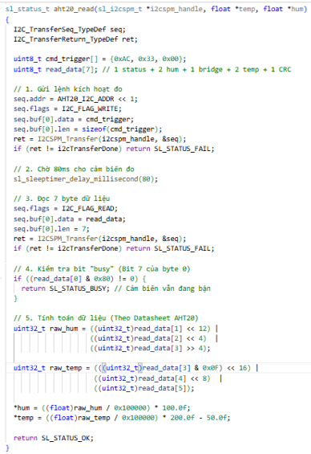
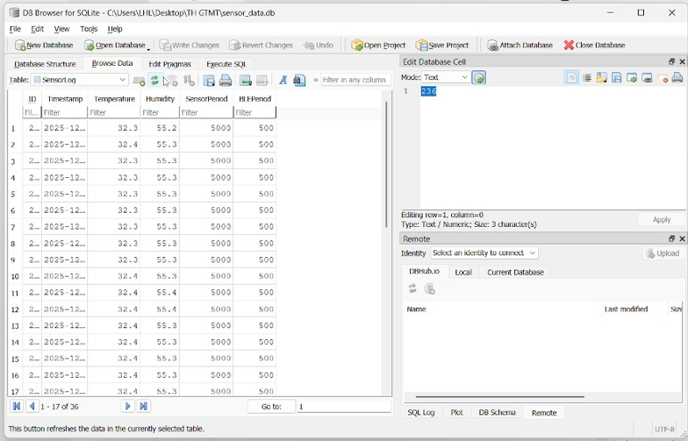
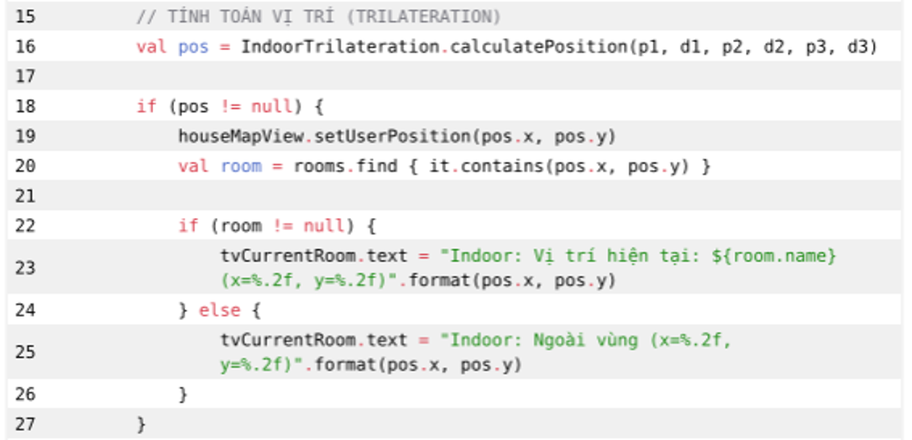
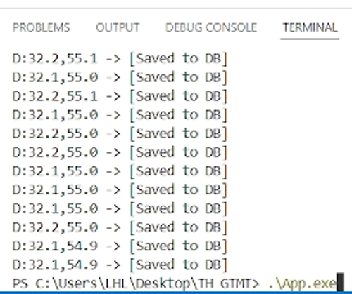
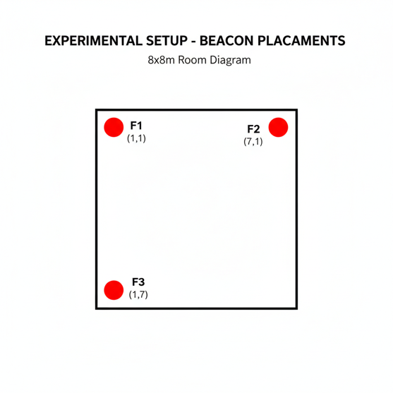
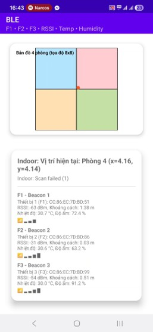
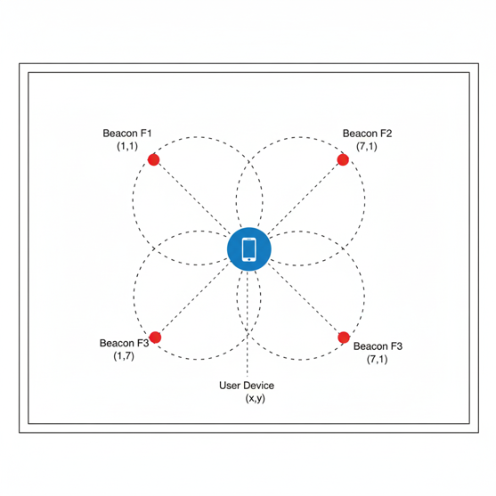
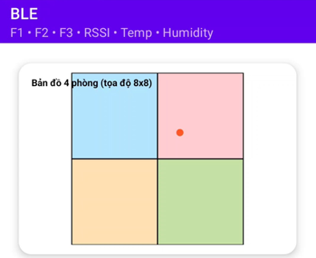
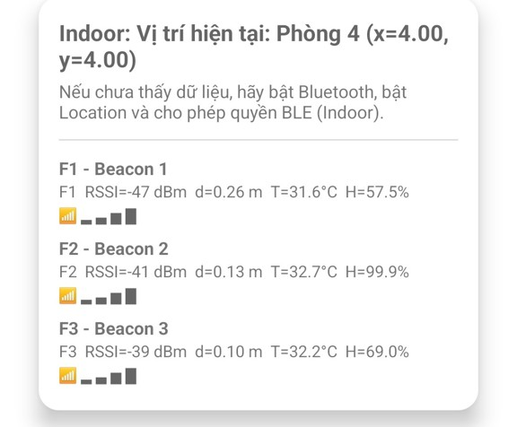

# Computer Interfacing, BLE Sensing and Indoor Positioning Lab

<p align="center">
  <a href="https://github.com/lhlizdabezt/ThucHanhGTMT/releases/latest"></a>
  <a href="https://github.com/lhlizdabezt/ThucHanhGTMT/tags"></a>
  
</p>

<p align="center">
  
</p>

## Overview

`ThucHanhGTMT` documents a computer interfacing lab where an AHT20 temperature and humidity sensor is read through I2C on a Silicon Labs BLE SoC, displayed locally on an LCD, advertised through BLE payload data, and logged on a Windows host through UART/VCOM and SQLite. The same evidence package also preserves BLE RSSI indoor-positioning work with beacon placement, trilateration logic and Android map screenshots.

The repository is written for HR screening and engineering review. It keeps the project scope clear: this is a student lab and portfolio evidence package, not a commercial data-acquisition product.

## Repository Status

| Field | Status |
|---|---|
| Repository | [github.com/lhlizdabezt/ThucHanhGTMT](https://github.com/lhlizdabezt/ThucHanhGTMT) |
| Portfolio category | Computer interfacing, embedded data acquisition, BLE sensor logging, BLE RSSI indoor positioning |
| Review status | Portfolio-ready academic lab snapshot |
| Latest release | [GitHub Releases](https://github.com/lhlizdabezt/ThucHanhGTMT/releases/latest) |
| Version tags | [Repository tags](https://github.com/lhlizdabezt/ThucHanhGTMT/tags) |
| Visual evidence | Firmware, terminal, SQLite, beacon placement, trilateration and Android BLE map screenshots |
| Visual policy | English README labels, ASCII-safe SVG text, no moving connector-line patterns |
| Hardware dependency | Silicon Labs BLE SoC, AHT20 sensor, LCD and UART/VCOM connection |
| Host dependency | Windows C build environment, SQLite source files and an available COM port |

## System Flow

| Stage | Evidence in Repository | Engineering Point |
|---|---|---|
| Sensor input | `LONG1_2-20260513T142225Z-3-001/LONG1_2/aht20.c` | Starts and reads AHT20 temperature and humidity measurements over I2C |
| Embedded processing | `LONG1_2-20260513T142225Z-3-001/LONG1_2/app.c` | Converts sensor values, updates advertising data and prints UART log frames |
| Local display | `LONG1_2-20260513T142225Z-3-001/LONG1_2/lcd_display.c` | Shows measured data on the LCD without relying on host-side parsing |
| BLE payload | `LONG1_2-20260513T142225Z-3-001/LONG1_2/custom_adv.c` | Packs manufacturer-specific BLE advertising bytes with BCD sensor values |
| Host logging | `TH GTMT-20260513T142230Z-3-001/TH GTMT/TEST.c` | Reads UART/VCOM frames and stores timestamped records in SQLite |
| Indoor positioning | `LONG1_2-20260513T142225Z-3-001/LONG1_2/a.kt` and `k.kotlin.calculateP` | Captures the RSSI, trilateration and room-map logic used in the Android BLE view |
| Portfolio visual | `assets/gtmt-data-flow.gif` | Shows the sensor-to-database flow without moving connector lines |

## Evidence Highlights

- AHT20 sensor acquisition through I2C.
- Silicon Labs BLE SoC firmware path with LCD display, BLE advertising and UART/VCOM logging.
- Windows-side C logger using SQLite for timestamped sensor records.
- BLE RSSI indoor-positioning evidence with F1/F2/F3 beacons, 8x8 room mapping and Android screen captures.
- Release-backed GIF and SVG assets designed for GitHub README rendering.
- Reports and slide material preserved as reviewable course artifacts.

## Visual Evidence

The screenshots are preserved as technical evidence from the lab. The README captions, alt text and table labels are written in English for international review.

| Firmware and host logging | Database evidence | Indoor-positioning logic |
|---|---|---|
|  |  |  |
| AHT20 command trigger, read buffer and conversion formula. | Logged sensor rows in the SQLite review table. | Position calculation path for the Android indoor map. |

| UART and BLE runtime | Beacon placement | Android map result |
|---|---|---|
|  |  |  |
| UART/VCOM frames are parsed and saved to SQLite. | F1, F2 and F3 placement for room-coordinate review. | Mobile BLE view with map position and beacon telemetry. |

| RSSI model view | Map close-up | Beacon readings |
|---|---|---|
|  |  |  |
| Trilateration concept used by the indoor-positioning prototype. | Current position rendered on a four-room 8x8 map. | Beacon RSSI, distance, temperature and humidity values. |

## Evidence Index

| Asset | Review purpose |
|---|---|
| `assets/evidence/aht20-i2c-read.png` | AHT20 I2C read sequence and datasheet conversion formula |
| `assets/evidence/uart-vcom-sqlite-terminal.png` | UART/VCOM data stream and host save confirmation |
| `assets/evidence/sqlite-sensor-table.png` | SQLite database records for temperature, humidity, RSSI and sensor period values |
| `assets/evidence/beacon-placement-room-diagram.png` | 8x8 beacon placement setup for F1, F2 and F3 |
| `assets/evidence/rssi-trilateration-diagram.png` | RSSI trilateration concept and user-device coordinate estimate |
| `assets/evidence/kotlin-trilateration-snippet.png` | Android/Kotlin position update logic |
| `assets/evidence/android-ble-position-screen.jpg` | Mobile BLE screen with room position and beacon telemetry |
| `assets/evidence/android-room-map.png` | Map close-up for the estimated user position |
| `assets/evidence/android-beacon-readings.jpg` | RSSI, distance, temperature and humidity readings per beacon |

## Repository Structure

| Path | Purpose |
|---|---|
| `assets/` | README-ready SVG and GIF visuals for portfolio review |
| `assets/evidence/` | Project screenshots used as reviewer evidence |
| `LONG1_2-20260513T142225Z-3-001/LONG1_2/` | Silicon Labs BLE SoC firmware project and sensor/display source files |
| `TH GTMT-20260513T142230Z-3-001/TH GTMT/` | Windows C/SQLite UART logger source tree |
| `22207056_report_DoAn.pdf` | Project report artifact |
| `22207056_report_DoAn (2).pptx` | Project presentation artifact |
| `22207056_report_lab6.pdf` | Supporting lab report artifact |
| `scripts/render_gtmt_data_flow.py` | Repeatable renderer for the English GIF visual |

## How to Review

1. Start with this README to understand the project boundary and evidence map.
2. Open the latest release to confirm the preserved review snapshot and release assets.
3. Inspect `app.c`, `aht20.c`, `lcd_display.c` and `custom_adv.c` for the embedded sensor path.
4. Inspect `TEST.c` for the Windows host logger, COM-port handling and SQLite insert flow.
5. Inspect `a.kt`, `k.kotlin.calculateP` and `assets/evidence/` for the BLE RSSI indoor-positioning evidence.
6. Check `assets/gtmt-data-flow.gif` and `assets/portfolio-motion.svg` for the portfolio-facing visual summary.
7. Use the reports for course context, diagrams and lab deliverables.

## Run or Inspect Locally

The firmware side requires the Silicon Labs toolchain and compatible hardware. The host logger can be inspected without hardware, but live logging requires the board to stream UART frames.

### Firmware Review Path

```text
Open LONG1_2-20260513T142225Z-3-001/LONG1_2/LONG1_2.slcp in Simplicity Studio.
Review app.c for the timer, BLE event and UART log flow.
Review aht20.c for the I2C command sequence and conversion formula.
Review lcd_display.c for local display formatting.
```

### Indoor Positioning Review Path

```text
Review a.kt and k.kotlin.calculateP for the position-update logic.
Open assets/evidence/beacon-placement-room-diagram.png for the 8x8 room setup.
Open assets/evidence/android-room-map.png and android-beacon-readings.jpg for the Android BLE evidence.
Treat this as prototype evidence unless the full Android project is added later.
```

### Host Logger Build Path

```powershell
cd "TH GTMT-20260513T142230Z-3-001\TH GTMT"
gcc TEST.c sqlite3.c -o App.exe
```

Before running the logger, edit `COM_PORT_NAME` in `TEST.c` to match the board's actual COM port. The source currently uses a Windows serial path format such as `\\\\.\\COM10`.

```powershell
.\App.exe
```

## FAQ

| Question | Answer |
|---|---|
| Is this a production data-acquisition system? | No. It is a lab workflow and portfolio evidence package. |
| What should a reviewer focus on first? | The AHT20 I2C read flow, BLE advertising payload, UART/VCOM logger, SQLite insert path and BLE RSSI map evidence. |
| Why are the visuals English-only? | The repository is intended for international HR and engineering review, and SVG/GIF text must avoid mojibake or unreadable labels. |
| Why avoid connector-line animation? | GitHub profile cards can become visually noisy at small widths. The current visuals use cards and pulses instead. |
| What are F1, F2 and F3? | They are BLE beacon references used for the indoor-positioning room diagram and RSSI evidence. |
| Does the repository contain a full Android project? | No. It preserves Kotlin logic snippets and screenshots for review context, while the complete Android project would need to be added separately. |
| Can the project run without hardware? | The source can be reviewed and parts can be built, but live sensor logging requires the board, sensor, LCD and COM port. |

## Scope and Boundaries

This repository demonstrates embedded firmware, interface debugging, host-side sensor logging and BLE RSSI indoor-positioning evidence in a lab setting. It does not claim industrial calibration, production security hardening, cloud telemetry, field deployment, certified location accuracy, or long-term reliability testing.

## Professional Links

| Channel | Link |
|---|---|
| GitHub profile | [github.com/lhlizdabezt](https://github.com/lhlizdabezt) |
| Resume | [Luong Hai Long CV](https://github.com/lhlizdabezt/lhlizdabezt/blob/main/resume/Luong_Hai_Long_CV.pdf) |
| LinkedIn | [linkedin.com/in/lhlizdabezt](https://www.linkedin.com/in/lhlizdabezt) |
| Work email | [luonghailong.work@gmail.com](mailto:luonghailong.work@gmail.com) |
| Student email | [22207056@student.hcmus.edu.vn](mailto:22207056@student.hcmus.edu.vn) |
| Phone | [+84 988 114 708](tel:+84988114708) |
| Facebook | [facebook.com/wageseadrake](https://www.facebook.com/wageseadrake) |
| Instagram | [instagram.com/lhlizdabezt](https://www.instagram.com/lhlizdabezt) |
| YouTube | [youtube.com/@lhlizdabezt](https://www.youtube.com/@lhlizdabezt) |
| TikTok | [tiktok.com/@wageseadrake](https://www.tiktok.com/@wageseadrake) |

## Writing Standard

The README follows an evidence-first style: direct technical nouns, clear academic boundaries, release-backed artifacts, reviewable source paths and no inflated claims beyond what the repository can support.
