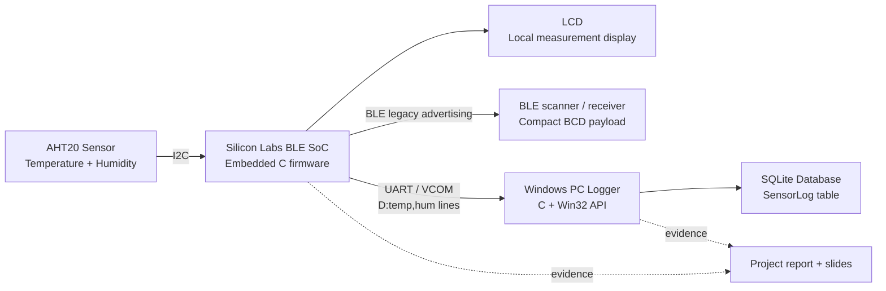

# ThucHanhGTMT — AHT20 BLE Data Acquisition System

<p align="center">
  
</p>

<p align="center">
  <a href="https://github.com/lhlizdabezt/ThucHanhGTMT/releases/tag/v1.0.0"></a>
  
  
  
</p>

This repository packages the source code, reports and presentation material for **Thực hành Giao tiếp máy tính và Thu nhận dữ liệu** at the Faculty of Electronics and Telecommunications, VNUHCM - University of Science.

The main project is a **temperature and humidity acquisition system**: a Silicon Labs BLE SoC reads an AHT20 sensor over I2C, displays values locally on LCD, publishes compact temperature/humidity bytes through BLE advertising, streams UART/VCOM logs, and lets a Windows C application persist sensor rows into SQLite.

## Reviewer Snapshot

| Signal | Evidence |
| --- | --- |
| Course / lab scope | Computer communication and data acquisition, HCMUS FETEL |
| Embedded target | Silicon Labs Bluetooth SoC project generated for Simplicity Studio |
| Sensor path | AHT20 over I2C, decoded as temperature and humidity |
| Local output | LCD display update for temperature, humidity and sampling period |
| Wireless output | BLE legacy advertising payload with BCD-encoded sensor values |
| PC integration | Win32 serial port reader, `D:temp,hum` parser, SQLite `SensorLog` table |
| Deliverables | Firmware source, PC logger source, project report, slides, BLE Mesh lab report |

## System Architecture



## Repository Layout

| Path | Purpose |
| --- | --- |
| `LONG1_2-20260513T142225Z-3-001/LONG1_2/` | Silicon Labs BLE firmware project with AHT20, LCD, BLE advertising and UART log logic. |
| `LONG1_2-20260513T142225Z-3-001/LONG1_2/LONG1_2.slcp` | Main Simplicity Studio project file. |
| `LONG1_2-20260513T142225Z-3-001/LONG1_2/app.c` | Application flow: timer-based sensor read, LCD update, BLE payload update and UART logging. |
| `LONG1_2-20260513T142225Z-3-001/LONG1_2/aht20.c` | AHT20 sensor driver over I2C. |
| `LONG1_2-20260513T142225Z-3-001/LONG1_2/lcd_display.c` | LCD rendering helper for measured values. |
| `TH GTMT-20260513T142230Z-3-001/TH GTMT/TEST.c` | Windows C console logger for UART/VCOM input and SQLite persistence. |
| `TH GTMT-20260513T142230Z-3-001/TH GTMT/sqlite3.c` | SQLite amalgamation used by the PC logger. |
| `22207056_report_DoAn.pdf` | Final project report: temperature and humidity measurement system. |
| `22207056_report_DoAn (2).pptx` | Project presentation deck. |
| `22207056_report_lab6.pdf` | Lab 6 report: Bluetooth Low Energy Mesh. |

## Firmware Highlights

The embedded project opens from:

```text
LONG1_2-20260513T142225Z-3-001/LONG1_2/LONG1_2.slcp
```

Core implementation points:

- `app_timer_start(...)` schedules periodic sensor acquisition.
- `aht20_read(...)` returns temperature and humidity values from the AHT20.
- `lcd_update(...)` refreshes local display lines for temperature, humidity and period.
- `update_ble_payload(...)` constructs a 31-byte BLE advertising buffer with flags, device name and manufacturer-specific sensor bytes.
- `app_log("D:%d.%d,%d.%d\r\n", ...)` emits UART/VCOM telemetry in a PC-friendly format.

Expected development environment:

- Simplicity Studio
- Gecko SDK / Simplicity SDK compatible with the checked-in project
- GNU Arm Embedded Toolchain
- Silicon Labs BLE SoC board with VCOM/UART
- AHT20 temperature-humidity sensor and LCD module

## PC Logger

The Windows logger source is:

```text
TH GTMT-20260513T142230Z-3-001/TH GTMT/TEST.c
```

It performs four reviewer-visible jobs:

- Opens the configured COM port through the Win32 API.
- Reads UART/VCOM bytes from the board.
- Parses sensor lines that match `D:temp,hum`.
- Inserts rows into SQLite table `SensorLog` with timestamp, temperature, humidity and period fields.

Build on Windows with GCC:

```powershell
cd "TH GTMT-20260513T142230Z-3-001\TH GTMT"
gcc TEST.c sqlite3.c -o App.exe
.\App.exe
```

Before running, update the COM port in `TEST.c`:

```c
const char* COM_PORT_NAME = "\\\\.\\COM10";
```

Replace `COM10` with the actual Silicon Labs VCOM port shown on the machine.

## Clone Note For Windows

The Silicon Labs project contains long generated metadata paths. If checkout fails on Windows with `Filename too long`, enable long paths for this local clone and retry checkout:

```powershell
git config core.longpaths true
git checkout -f HEAD
```

## Reports And Presentation

- `22207056_report_DoAn.pdf` documents objectives, system design, operating principle and results for the temperature/humidity measurement project.
- `22207056_report_DoAn (2).pptx` is the project presentation deck.
- `22207056_report_lab6.pdf` documents BLE Mesh practice, including student-ID transmission and LED/runtime status transfer.

## Ownership

| Field | Value |
| --- | --- |
| Student | Lương Hải Long |
| Student ID | 22207056 |
| Class | 22DTV_CLC1 |
| Major | Electronics and Telecommunications |
| Faculty | Khoa Điện tử - Viễn thông |
| University | Trường Đại học Khoa học Tự nhiên - ĐHQG TP.HCM |
| Instructors | ThS. Đặng Tấn Phát, CN. Hồ Thanh Bảo |
| Project title | Hệ thống đo nhiệt độ và độ ẩm |

## Release

`v1.0.0` marks the first polished public release of the repository as a reviewable engineering artifact: firmware source, PC logger, report, slide deck, BLE Mesh lab report, repository description, topics and documentation are organized for HR screening and technical review.

## Maintenance Notes

This repository tracks source code, project configuration and required documentation. Generated runtime/build outputs such as `.exe`, `.dll`, `.db`, `.o`, `.map`, `.hex`, `.bin` and toolchain build directories should remain outside Git unless a future release explicitly needs binary artifacts.
