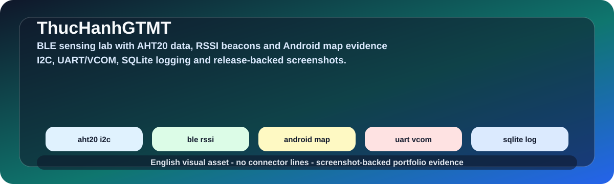

# Computer Interfacing and BLE Data Acquisition Lab

  
  
  

  

## Overview

This repository documents a sensor-to-host data acquisition flow using a Silicon Labs BLE SoC, AHT20 sensor data, I2C, UART/VCOM transport and a Windows C/SQLite logger.

| Field | Details |
|---|---|
| Repository | [ThucHanhGTMT](https://github.com/lhlizdabezt/ThucHanhGTMT) |
| Portfolio category | Computer interfacing / embedded data-acquisition lab |
| Primary stack | Silicon Labs BLE SoC, embedded C, I2C, BLE, UART/VCOM, LCD, Windows C, SQLite, sensor logging. |
| Latest release | [GitHub Releases](https://github.com/lhlizdabezt/ThucHanhGTMT/releases/latest) |
| Tags | [Version tags](https://github.com/lhlizdabezt/ThucHanhGTMT/tags) |
| Owner profile | [Luong Hai Long](https://github.com/lhlizdabezt) |

## Reviewer Map

| What to Review | Where to Look | Why It Matters |
|---|---|---|
| Technical scope | This README and source tree | Gives a quick, bounded reading path before opening every file |
| Evidence assets | Release page and top-level project files | Shows what can be downloaded or inspected quickly |
| Implementation material | Source folders, scripts, notebooks or design files | Connects the portfolio claim to real project artifacts |
| Version history | Tags and release notes | Makes the repository easier to audit over time |

## Evidence Highlights

- AHT20 sensor data acquisition through I2C.
- BLE advertising and embedded firmware workflow on Silicon Labs hardware.
- UART/VCOM transfer into a Windows-side C logger with SQLite storage.
- Motion GIF and release assets for fast review.

## Repository Structure

| Path | Purpose |
|---|---|
| `assets/` | Top-level directory included in the repository |
| `LONG1_2-20260513T142225Z-3-001/` | Top-level directory included in the repository |
| `TH GTMT-20260513T142230Z-3-001/` | Top-level directory included in the repository |
| `22207056_report_DoAn (2).pptx` | Top-level file included in the repository |
| `22207056_report_DoAn.pdf` | Top-level file included in the repository |
| `22207056_report_lab6.pdf` | Top-level file included in the repository |

## Scope and Boundaries

Computer interfacing lab evidence. The implementation is presented as a student lab workflow, not an industrial data-acquisition product.

## Role and Portfolio Context

Luong Hai Long uses this repository to show embedded firmware, interface debugging and host-side data logging.

## Release and Tagging Notes

This repository is maintained as part of an English-facing engineering portfolio. Releases and tags are used to preserve reviewable snapshots of the project, including source state, documentation updates and any available visual or report assets.

## Writing Standard

The README follows an evidence-first style: direct technical nouns, clear project boundaries, release-backed artifacts and no inflated claims beyond what the repository can support.
